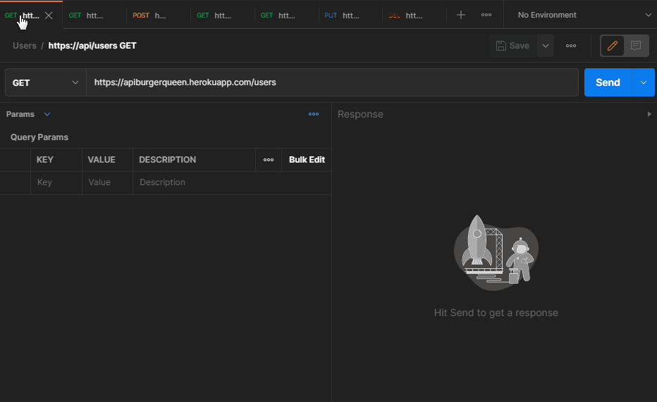
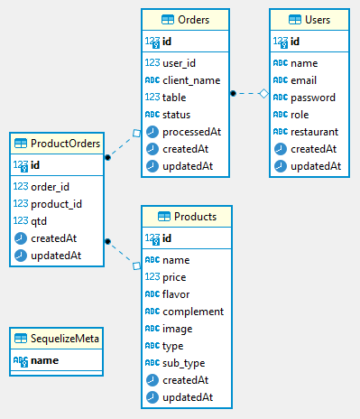

# Burger Queen API :hamburger: :hamburger:

Acesse a aplicação no link: https://apiburgerqueen.herokuapp.com/

## Índice

* [1. Apresentação](#1-apresentação)
* [2. Sobre o Projeto](#2-sobre-o-projeto)
* [3. Como Utilizar](#3-como-utilizar)
* [4. Estrutura do Banco de Dados](#4-estrutura-do-banco-de-dados)
* [5. Organização e Planejamento](#5-organização-e-planejamento)
* [6. Bibliotecas e Ferramentas Utilizadas](#6-bibliotecas-e-ferramentas-utilizadas)
* [7. Desenvolvedora](#7-desenvolvedora)

***

## 1. Apresentação :sparkles:

Projeto realizado durante o Bootcamp Laboratória - SAP005, com intuito de criarmos 
uma _API rest_ para ser compatível com as requisições vindas do front.

O servidor web, que é basicamente um programa que ouve o que acontece na aplicação 
através de uma porta de rede, pela qual podemos enviar requisições (requests) e 
obter respostas (responses) deve _servir_ `JSON` através de uma conexão `HTTP`.

## 2. Sobre o Projeto :memo:

A interface front-end da aplicação Burger Queen já estava criada. 

Acesse [Lab Burger](https://lab-burger.vercel.app/) para visualizar.

Agora foi desenvolvido o back-end para manejar os dados contendo os seguintes endpoints:

#### `/users`

* `GET /users`
* `GET /users/:uid`
* `POST /users`
* `PUT /users/:uid`
* `DELETE /users/:uid`

#### `/products`

* `GET /products`
* `GET /products/:productid`
* `POST /products`
* `PUT /products/:productid`
* `DELETE /products/:productid`

#### `/orders`

* `GET /orders`
* `GET /orders/:orderId`
* `POST /orders`
* `PUT /orders/:orderId`
* `DELETE /orders/:orderId`

## 3. Como Utilizar :mag_right:

Acesse o link https://apiburgerqueen.herokuapp.com/ com o endpoint de acordo com o que deseja fazer ou visualizar na API.

  

<!--  -->

## 4. Estrutura do Banco de Dados :key:

  </img>

<!--  -->

## 5. Organização e Planejamento :calendar:

Foi utilizada a ferramenta Projects do gitHub para organizar todas as atividades a serem feitas,
dividindo da seguinte forma: a fazer / em progresso / feito / sprint concluída.

Abaixo o quadro de organização:

## 6. Bibliotecas e Ferramentas Utilizadas :wrench::hammer:

- [Node.js](https://nodejs.org/)
- [Express](https://expressjs.com/)
- [Sequelize](https://sequelize.org)
- [Heroku](https://www.heroku.com/home) com integração ao [PostgreSQL](https://www.heroku.com/postgres) para deploy da API
- [Postman](https://www.getpostman.com) para fazer testes das requisições
- DBeaver para visualizar tabelas e suas relações
- [ESLint](https://eslint.org/docs/user-guide/getting-started)
- VsCode
- GitHub
- GitHub Projects

## 7.Desenvolvedora :woman:

Aplicação desenvolvida por: 

<a href=“www.github.com/gabrielasilva1991/“> Gabriela Silva</a>
